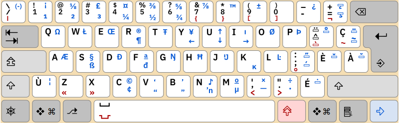

J'ai commencé à apprendre le français il y a 5 mois, en janvier 2025. Depuis lors, j'ai toujours utilisé un stylo pour écrire en français même s'il est plus facile d'écrire sur un clavier. Après un certain temps, j'ai commencé chercher un bon clavier à utiliser quand je fais mes devoirs. 

Le premier clavier que j'ai touvé, c'etait [la disposition AZERTY](https://en.wikipedia.org/wiki/AZERTY). Pour quelqu'un habituè à la QWERTY, utiliser une disposition si differente est presque impossible. J'ai essayé de m'en servir pendant un certain temps avant de l'abandoner. 

*source: [https://en.wikipedia.org/wiki/AZERTY](https://en.wikipedia.org/wiki/AZERTY)*

J’étais sûr qu’il existait un clavier similaire au QWERTY. J'ai cherché un peu plus sur Google, et j'ai trouvè [QWERTY-fr](https://qwerty-fr.org/). Ce clavier , c'est un projet open source mais ce n'est pas utilisable partout (par exemple, il n'y a pas de version pour les portables).Donc, il faut l'installer sur tous les appareils. 

J'ai aussi trouvè la disposition canadienne française, le clavier CSA. Cela a beaucoup en commun avec le QWERTY, avec quelques petites diffèrences. Je l'ai utilisée pour écrire cet article de blog, et c'est relativement facile.

*source: [https://en.wikipedia.org/wiki/CSA_keyboard](https://en.wikipedia.org/wiki/CSA_keyboard)*

Maintenant, je dois commencer à ècrire tous mes textes français en utilisant le CSA et m’y habituer. Bonne chance à moi!
